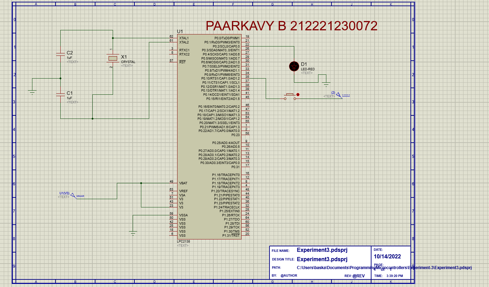
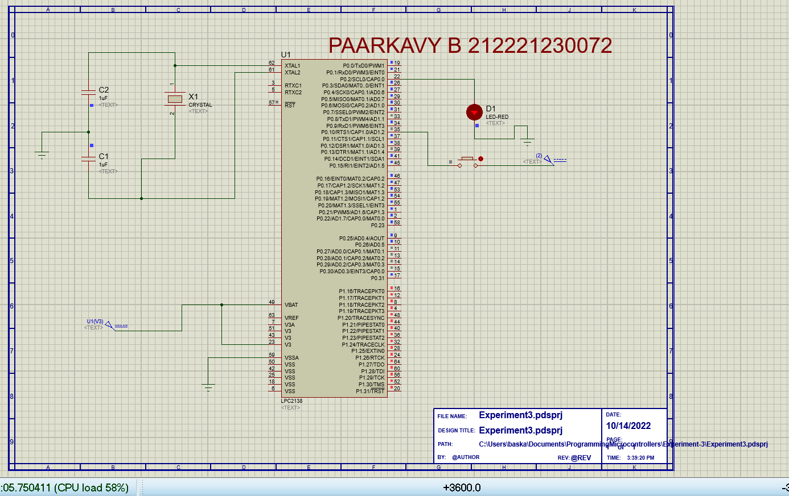
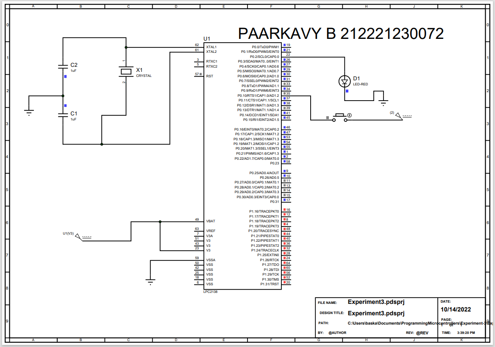

# Interfacing a Digital INPUT push button to LPC2148 ARM 7 Microcontroller

# AIM:
To Interface a Digital input (pushbutton ) to LPC2148 ARM 7 and write a code to switch on and of an LED.

# COMPONENTS REQUIRED:
Proteus ISIS professional suite, Kiel μ vision 5 Development environment.

# THEORY: 
The full form of an ARM is an advanced reduced instruction set computer (RISC) machine, and it is a 32-bit processor architecture expanded by ARM holdings. The applications of an ARM processor include several microcontrollers as well as processors. The architecture of an ARM processor was licensed by many corporations for designing ARM processor-based SoC products and CPUs. This allows the corporations to manufacture their products using ARM architecture. Likewise, all main semiconductor companies will make ARM-based SOCs such as Samsung, Atmel, TI etc.

What is an ARM7 Processor?
ARM7 processor is commonly used in embedded system applications. Also, it is a balance among classic as well as new-Cortex sequence. This processor is tremendous in finding the resources existing on the internet with excellence documentation offered by NXP Semiconductors. It suits completely for an apprentice to obtain in detail hardware & software design implementation.
LPC2148 Microcontroller
 The LPC2148 microcontroller is designed by Philips (NXP Semiconductor) with several in-built features & peripherals. Due to these reasons, it will make more reliable as well as the efficient option for an application developer. LPC2148 is a 16-bit or 32-bit microcontroller based on ARM7 family.
Features of LPC2148
The main features of LPC2148 include the following.
•	The LPC2148 is a 16 bit or 32 bit ARM7 family based microcontroller and available in a small LQFP64 package.
•	ISP (in system programming) or IAP (in application programming) using on-chip boot loader software.
•	On-chip static RAM is 8 kB-40 kB, on-chip flash memory is 32 kB-512 kB, the wide interface is 128 bit, or accelerator allows 60 MHz high-speed operation.
•	It takes 400 milliseconds time for erasing the data in full chip and 1 millisecond time for 256 bytes of programming.
•	Embedded Trace interfaces and Embedded ICE RT offers real-time debugging with high-speed tracing of instruction execution and on-chip Real Monitor software.
•	It has 2 kB of endpoint RAM and USB 2.0 full speed device controller. Furthermore, this microcontroller offers 8kB on-chip RAM nearby to USB with DMA.
•	One or two 10-bit ADCs offer 6 or 14 analogs i/ps with low conversion time as 2.44 μs/ channel.
•	Only 10 bit DAC offers changeable analog o/p.
•	External event counter/32 bit timers-2, PWM unit, & watchdog.
•	Low power RTC (real time clock) & 32 kHz clock input.
•	Several serial interfaces like two 16C550 UARTs, two I2C-buses with 400 kbit/s speed.
•	5 volts tolerant quick general purpose Input/output pins in a small LQFP64 package.
•	Outside interrupt pins-21.
•	60 MHz of utmost CPU CLK-clock obtainable from the programmable-on-chip phase locked loop by resolving time is 100 μs.
•	The incorporated oscillator on the chip will work by an exterior crystal that ranges from 1 MHz-25 MHz
•	The modes for power-conserving mainly comprise idle & power down.
•	For extra power optimization, there are individual enable or disable of peripheral functions and peripheral CLK scaling.
 

# PROCEDURE:
For creation of project on    Kiel μ vision 5 Development environment (LPC21 XX/48/38)
1.	Click on the menu Project — New µVision Project creates a new project. Select an empty folder and enter the project name, for example Project1. It is good practice to use a separate folder for each project.
2.	Next, the dialog Select Device for Target opens.

Figure -01 Target selection
Select the device database. Default is Software Packs. You can have various local device databases, which show up in the drop-down box. For legacy devices (Arm7, Arm9), use the Legacy Device Database [no RTE]
3.	Select the device for your application. This selection defines essential tool settings such as compiler controls, the memory layout for the linker, and the Flash programming algorithms.
4.	Click OK.
5.	Click on the new file option and save the file using save option with .C extension 

For creating the simulation environment in Proteus suite 
Starting New Design


Step 1: Open ISIS software and select New design in  File menu
 

Figure -02 Proteus File Menu

 Step 2: A dialogue box appears to save the current design. However, we are creating a new design file so you can click Yes or No depending on the content of the present file. Then a Pop-Up appears asking to select the template. It is similar to selecting the paper size while printing. For now select default or according to the layout size of the circuit.
 

Figure -03 Proteus Default Template Select
 
Step 3:An untitled design sheet will be opened, save it according to your wish,it is better to create a new folder for every layout as it generates other files supporting your design. However,it is not mandatory.

  
Figure -04 Proteus Design Sheet
 
Step 4:To Select components, Click on the component mode button.
 

Figure -05 Component Mode
Step 5:Click On Pick from Libraries. It shows the categories of components available and a search option to enter the part name.
 

Figure -06 Pick from Libraries

Step 6: Select the components from categories or type the part name in Keywords text box.
 Place all the required components and route the wires i.e, make connections.
Either selection mode above the component mode or component mode allows to connect through wires. Left click from one terminal to other to make connection. Double right-click on the connected wire or the component to remove connection or the component respectively.
 

Figure -07 Component Properties Selection
Double click on the component to edit the properties of the components and click on Ok.
Step 8: Select ARM microcontroller form the library – pick part 
 
  
Figure -08 LPC2138/48 selection
Step 7:

After making necessary connections click on debug from 
 Figure -09 Keywords Textbox
Example shows selection of push button. Select the components accordingly.
 

Figure -09 Push Button Selection
Step 8: The selected components will appear in the devices list. Select the component and place it in the design sheet by left-click., post which select all the associated components as shown in the circuit diagram below 

 
Figure -10 Circuit diagram of LED interface on port -0


 
Figure -11 Hex file for simulation 

Step 9: Select the hex file from the Kiel program folder and import the program in to the microcontroller as shown in figure 11 ,  debug and if no errors in connections are found, run the VSM simulation to view the output.

# KIEL-PROGRAM:
```
Name : PAARKAVY B
Roll no : 212221230072
Date of experiment : 14/10/22
```

```
#include <LPC214x.h>   // define LPC2148 Header file
#define led (1<<2)     // led macro for pin 2 of port0
#define sw (1<<10)     // sw macro for pin 10 of port0
int main(void)
{
	unsigned int x;
	IO0DIR|=(~sw);   // configure P1.24 - P1.31 as input
	IO0DIR|=led;     // configure P1.16 - P1.23 as output
	while(1)
	{
		x = IOPIN0 & sw;   //save status of sw in variable x
		if(x==sw)          // if switch open
		{
			IOCLR0|=led; // LED off
		}
		else               // if switch close
		{
			IOSET0 = led;  // LED on
		}
	}
}
```  

# OUTPUT:






# RESULT:
Interfacing a digital output with ARM microcontroller is executed.


